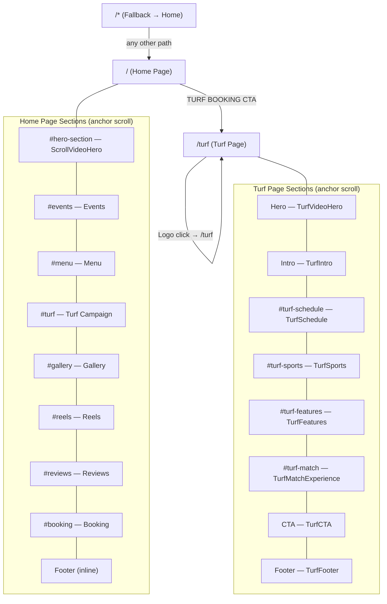
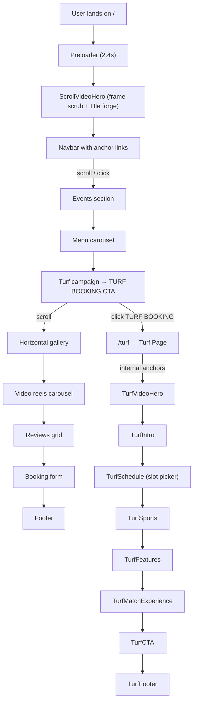

# R Sports & Cafe — Website Blueprint

> Documented from the running app at `http://localhost:5173` and full source analysis.  
> **Date:** 2026-07-24 &nbsp;|&nbsp; **Stack:** Vite + React 19 + Tailwind CSS v4 + GSAP + Framer Motion + Three.js + Lenis

---

## 1. Sitemap



### Routing Implementation

Routing is manual in [main.jsx](file:///c:/Users/sandle/cafe/src/main.jsx) — no React Router:

```js
const path = window.location.pathname;
// path === '/turf' → <TurfPage />
// everything else  → <App />
```

Any path that is **not** `/turf` renders the Home page (implicit fallback).

---

## 2. User Flow



### Key user journeys:

| Journey | Steps |
|---------|-------|
| **Browse & Book** | Land → Preloader → Scroll hero → Events → Menu → Booking form → Submit |
| **Turf Booking** | Land → Scroll to Turf section → Click "TURF BOOKING" → /turf → TurfSchedule slot picker → TurfCTA |
| **Gallery Browse** | Land → Scroll to Gallery → Horizontal scrub through 5 cinematic images |
| **Reels Viewer** | Land → Scroll to Reels → Click center card → Fullscreen modal player (swipe to navigate) |
| **Review Read** | Land → Scroll to Reviews → Click card to expand → Read full testimonial |

---

## 3. Complete Page & Section Inventory

### Page 1: Home (`/`) — [App.jsx](file:///c:/Users/sandle/cafe/src/App.jsx)

| Order | Section ID | Component | File | Description |
|-------|------------|-----------|------|-------------|
| 0 | — | Preloader | [Preloader.jsx](file:///c:/Users/sandle/cafe/src/components/Preloader.jsx) | Fullscreen 2.4s loading screen with gold gradient title, progress bar, counter |
| 0 | — | SmoothScroll | [SmoothScroll.jsx](file:///c:/Users/sandle/cafe/src/components/SmoothScroll.jsx) | Lenis smooth-scroll wrapper |
| 0 | — | SectionColorMorph | [SectionColorMorph.jsx](file:///c:/Users/sandle/cafe/src/components/SectionColorMorph.jsx) | GSAP-driven bg color transitions per section |
| 0 | — | Cursor3D | [Cursor3D.jsx](file:///c:/Users/sandle/cafe/src/components/cursor/Cursor3D.jsx) | Three.js soccer ball 3D cursor follower |
| 0 | — | Navbar | [Navbar.jsx](file:///c:/Users/sandle/cafe/src/components/Navbar.jsx) | Fixed glass pill navbar with magnetic buttons |
| 1 | `#hero-section` | ScrollVideoHero | [ScrollVideoHero.jsx](file:///c:/Users/sandle/cafe/src/components/ScrollVideoHero.jsx) | 600vh scroll-scrubbed frame sequence (903 frames), shrink + title forge |
| 2 | `#events` | Events | [Events.jsx](file:///c:/Users/sandle/cafe/src/components/Events.jsx) | 2-column: sticky heading left, 3 event cards right |
| 3 | `#menu` | Menu | [Menu.jsx](file:///c:/Users/sandle/cafe/src/components/Menu.jsx) | 3-column carousel: text/video/meta with 4 menu items |
| 4 | `#turf` | Turf | [Turf.jsx](file:///c:/Users/sandle/cafe/src/components/Turf.jsx) | Cinematic video bg, split-letter "PLAY WITHOUT LIMITS", CTA to /turf |
| 5 | `#gallery` | Gallery | [Gallery.jsx](file:///c:/Users/sandle/cafe/src/components/Gallery.jsx) | Horizontal scroll pinned gallery with 5 cinematic cards |
| 6 | `#reels` | Reels | [Reels.jsx](file:///c:/Users/sandle/cafe/src/components/Reels.jsx) | 3D carousel of 5 Instagram-style video reels + fullscreen viewer modal |
| 7 | `#reviews` | Reviews | [Reviews.jsx](file:///c:/Users/sandle/cafe/src/components/Reviews.jsx) | Header + stats bar + 3-column expandable review cards (5 reviews) |
| 8 | `#booking` | Booking | [Booking.jsx](file:///c:/Users/sandle/cafe/src/components/Booking.jsx) | 2-column: typography left, glassmorphic form right (name/email/service/date/time) |
| 9 | — | Footer | Inline in [App.jsx](file:///c:/Users/sandle/cafe/src/App.jsx#L59-L140) | 4-column footer: brand, locations, social, legal + email subscribe + back-to-top |

### Page 2: Turf (`/turf`) — [TurfPage.jsx](file:///c:/Users/sandle/cafe/src/pages/TurfPage.jsx)

| Order | Section ID | Component | File | Description |
|-------|------------|-----------|------|-------------|
| 0 | — | TurfNavbar | [TurfNavbar.jsx](file:///c:/Users/sandle/cafe/src/components/turf/TurfNavbar.jsx) | Dark theme sticky navbar for turf page |
| 1 | — | TurfVideoHero | [TurfVideoHero.jsx](file:///c:/Users/sandle/cafe/src/components/turf/TurfVideoHero.jsx) | Scroll-controlled cinematic hero with lime accents |
| 2 | — | TurfIntro | [TurfIntro.jsx](file:///c:/Users/sandle/cafe/src/components/turf/TurfIntro.jsx) | Editorial intro section |
| 3 | `#turf-schedule` | TurfSchedule | [TurfSchedule.jsx](file:///c:/Users/sandle/cafe/src/components/turf/TurfSchedule.jsx) | Scoreboard-style slot booking system |
| 4 | `#turf-sports` | TurfSports | [TurfSports.jsx](file:///c:/Users/sandle/cafe/src/components/turf/TurfSports.jsx) | Sports experience showcase (football, cricket, badminton, fitness) |
| 5 | `#turf-features` | TurfFeatures | [TurfFeatures.jsx](file:///c:/Users/sandle/cafe/src/components/turf/TurfFeatures.jsx) | Feature cards grid |
| 6 | `#turf-match` | TurfMatchExperience | [TurfMatchExperience.jsx](file:///c:/Users/sandle/cafe/src/components/turf/TurfMatchExperience.jsx) | Immersive stats and match experience |
| 7 | — | TurfCTA | [TurfCTA.jsx](file:///c:/Users/sandle/cafe/src/components/turf/TurfCTA.jsx) | Final call-to-action section |
| 8 | — | TurfFooter | [TurfFooter.jsx](file:///c:/Users/sandle/cafe/src/components/turf/TurfFooter.jsx) | Dark footer with navigation, contact, socials |

---

## 4. Reusable Component Inventory

| Component | File | Props / Variants | Used In |
|-----------|------|------------------|---------|
| **MagneticButton** | [MagneticButton.jsx](file:///c:/Users/sandle/cafe/src/components/MagneticButton.jsx) | `children`, `strength` (default 0.3), `className` | Navbar, Events, Menu |
| **SmoothScroll** | [SmoothScroll.jsx](file:///c:/Users/sandle/cafe/src/components/SmoothScroll.jsx) | `children` — wraps app for Lenis smooth scroll | App.jsx |
| **Preloader** | [Preloader.jsx](file:///c:/Users/sandle/cafe/src/components/Preloader.jsx) | None — self-contained loading screen | App.jsx |
| **SectionColorMorph** | [SectionColorMorph.jsx](file:///c:/Users/sandle/cafe/src/components/SectionColorMorph.jsx) | None — reads section selectors from constant array | App.jsx |
| **Cursor3D** | [Cursor3D.jsx](file:///c:/Users/sandle/cafe/src/components/cursor/Cursor3D.jsx) | None — Three.js/R3F canvas overlay with soccer ball .glb | App.jsx |
| **Marquee** | [Marquee.jsx](file:///c:/Users/sandle/cafe/src/components/Marquee.jsx) | None — dual-track gold text marquee (not used in current render tree) | _Unused_ |
| **Stars** | Inline in [Reviews.jsx](file:///c:/Users/sandle/cafe/src/components/Reviews.jsx#L68-L81) | `count` (number 1-5) | Reviews |
| **ReviewCard** | Inline in [Reviews.jsx](file:///c:/Users/sandle/cafe/src/components/Reviews.jsx#L84-L203) | `review`, `index`, `isExpanded`, `onExpand` | Reviews |
| **Hero** | [Hero.jsx](file:///c:/Users/sandle/cafe/src/components/Hero.jsx) | `setShowLogo` — unused/replaced by ScrollVideoHero | _Unused_ |
| **Philosophy** | [Philosophy.jsx](file:///c:/Users/sandle/cafe/src/components/Philosophy.jsx) | None — editorial "PLAY. DINE. CONNECT." section | _Unused_ |

> [!NOTE]
> `Hero.jsx`, `Philosophy.jsx`, and `Marquee.jsx` exist in the components directory but are **not imported** in the current render tree. They appear to be earlier iterations replaced by `ScrollVideoHero`, the gallery section, and the Events section respectively.

---

## 5. Navigation Map

### Home Page Navbar

| Label | Target | Type |
|-------|--------|------|
| HOME | `#home` | Anchor (mapped to `#hero-section` via IntersectionObserver) |
| EVENTS | `#events` | Anchor |
| MENU | `#menu` | Anchor |
| TURF | `#turf` | Anchor |
| GALLERY | `#gallery` | Anchor |
| REVIEWS | `#reviews` | Anchor |
| BOOKING | `#booking` | Anchor |
| BOOK NOW | `#booking` | CTA Button |

### Home Page CTAs

| CTA Text | Location | Target |
|----------|----------|--------|
| View Full Calendar | Events section | `#booking` |
| Explore Menu | Menu section | `#booking` |
| Order Now | Menu section (mobile) | `#booking` |
| TURF BOOKING | Turf section | `/turf` (page navigation) |
| BECOME A MEMBER | Reviews section | `#booking` |
| Join (email) | Footer | — (no action) |
| Back to top | Footer | `window.scrollTo(0)` |

### Turf Page Navbar

| Label | Target | Type |
|-------|--------|------|
| R SPORTS | `/turf` | Logo link |
| SCHEDULE | `#turf-schedule` | Anchor |
| SPORTS | `#turf-sports` | Anchor |
| FEATURES | `#turf-features` | Anchor |
| EXPERIENCE | `#turf-match` | Anchor |
| BOOK NOW | `#turf-schedule` | CTA Button |

### Turf Page CTAs

| CTA Text | Location | Target |
|----------|----------|--------|
| BOOK YOUR SLOT | TurfVideoHero | `#turf-schedule` |
| VIEW TIMINGS | TurfVideoHero | `#turf-schedule` |

---

## 6. Technology & Library Inventory

| Category | Technology | Version |
|----------|-----------|---------|
| Framework | React | 19.2.6 |
| Build Tool | Vite | 8.0.12 |
| CSS Framework | Tailwind CSS | 4.3.1 |
| Animation (scroll) | GSAP + ScrollTrigger | 3.15.0 |
| Animation (UI) | Framer Motion | 12.40.0 |
| Smooth Scroll | Lenis | 1.3.23 |
| 3D Rendering | Three.js + @react-three/fiber + drei | 0.184.0 / 9.6.1 / 10.7.7 |
| Icons | Lucide React + Inline SVGs | 1.18.0 |
| Fonts | Satoshi (Fontshare) + Inter + Oswald (Google Fonts) | CDN |
